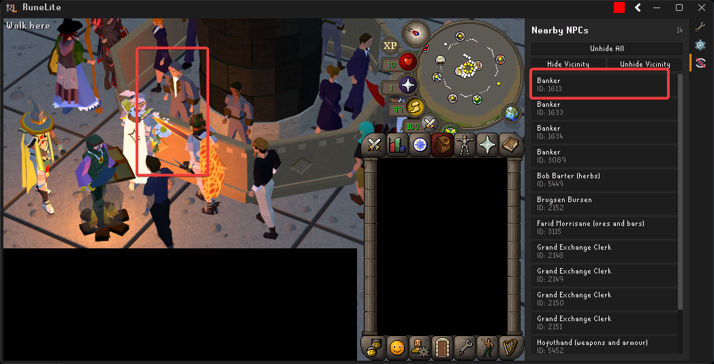
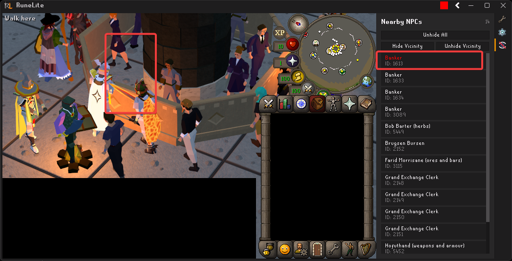

# Entity Hider Plus

A [RuneLite](https://runelite.net/) plugin that extends the native Entity Hider with an interactive sidebar panel for per-NPC visibility control.

## Features

### Dynamic NPC Panel
- Sidebar panel listing all nearby NPCs with name and ID
- **Click any NPC** to instantly toggle its visibility in-game
- Hidden NPCs turn **red** in the list; visible NPCs stay **white**
- **Hide Vicinity** / **Unhide Vicinity** buttons for bulk control
- **Unhide All** button with confirmation dialog
- Hidden NPC selections **persist across sessions**

### Native Entity Hider Features
All standard hiding options are included:
- Hide other players / 2D elements
- Hide party members, friends, clan/FC members, ignored players
- Hide local player / 2D
- Hide all NPCs / 2D
- Hide pets, thralls, random events
- Hide dead NPCs, attackers
- Hide boats, projectiles

## Screenshots

### NPC visible in-game (white in panel)


### NPC hidden (red in panel — gone from game while other NPCs remain)


## Installation

Search for **Entity Hider Plus** in the RuneLite Plugin Hub.

## Building from Source

```
./gradlew build
```

Requires Java 11+.
